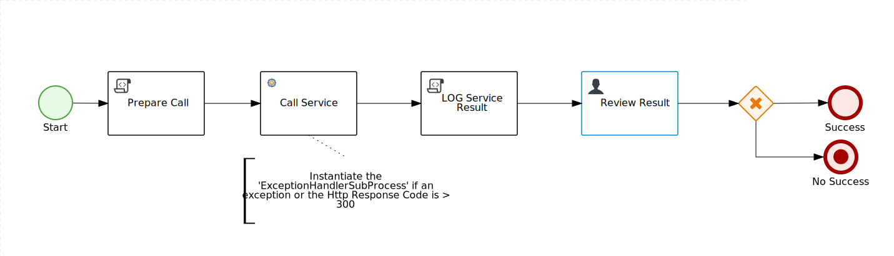
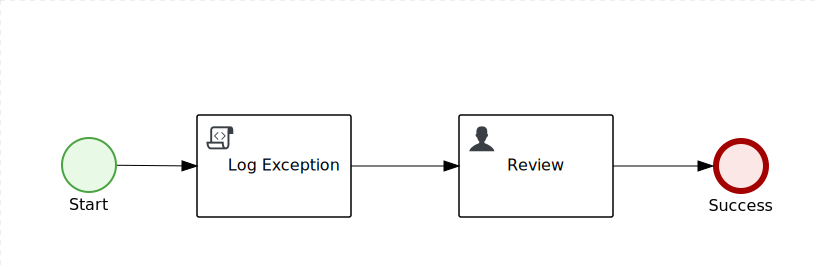

# Process Servicecall Exception Handling

## Process definitions

### Simple generic exception handler using Intermediate Error Catch Event


### Service call without Exception Handling strategy. 
Use the HTTP Response Code to test the Service Call response.



> Make sure the `HandleResponseErrors` (in the REST Service Task input parameters (Data Mapping)) is set to `false`.

 To use this strategy change the [kie-deployment-descriptor.xml](src/main/resources/META-INF/kie-deployment-descriptor.xml) to register the Rest Service Task.

```xml
     <work-item-handlers>
        <work-item-handler>
            <resolver>mvel</resolver>
            <identifier>new org.jbpm.process.workitem.rest.RESTWorkItemHandler(classLoader)</identifier>
            <parameters/>
            <name>Rest</name>
        </work-item-handler>
    </work-item-handlers>
```

### Rest Service Call with Signal Exception Handling using an Event Sub process


#### Use the [SignallingTaskHandlerDecorator](https://github.com/kiegroup/jbpm/blob/master/jbpm-bpmn2/src/main/java/org/jbpm/bpmn2/handler/SignallingTaskHandlerDecorator.java)
jBPM comes with a special Work Item handler Wrapper that can be used to decorate the [REST Service Task](https://github.com/kiegroup/jbpm/blob/master/jbpm-workitems/jbpm-workitems-rest/src/main/java/org/jbpm/process/workitem/rest/RESTWorkItemHandler.java) to send a Signal to the process instance when an exception occurs. To use it change the [kie-deployment-descriptor.xml](src/main/resources/META-INF/kie-deployment-descriptor.xml) to register it:

```xml
     <work-item-handlers>
        <work-item-handler>
            <resolver>mvel</resolver>
            <identifier>new org.jbpm.bpmn2.handler.SignallingTaskHandlerDecorator(new org.jbpm.process.workitem.rest.RESTWorkItemHandler(classLoader), "Error-serviceErrorSignal")</identifier>
            <parameters/>
            <name>Rest</name>
        </work-item-handler>
    </work-item-handlers>
```
> Note: make sure you set the `HandleResponseErrors` parameter to `true` in the *Rest Service Task* (`RESTWorkItemHandler`). This parameter is used to properly handle the exception. Otherwise it will just log the Http request error and return the error code in the `Result` output parameter.

### Rest Service Call with Exception Handling using a Sub process

 * Main Process
 

 * Sub process (exception handler)


This strategy is explained in detail in this blog post: http://mswiderski.blogspot.com/2018/10/handle-service-exceptions-via-subprocess.html

To use this strategy change the [kie-deployment-descriptor.xml](src/main/resources/META-INF/kie-deployment-descriptor.xml) to register the Rest Service Task informing the **Exception Handler Process Definition Id** along with the **Service task Completion Strategy**:

```xml
     <work-item-handlers>
        <work-item-handler>
            <resolver>mvel</resolver>
            <identifier>new org.jbpm.process.workitem.rest.RESTWorkItemHandler(classLoader, "ExceptionHandlerSubProcess", "RETRY")</identifier>
            <parameters/>
            <name>Rest</name>
        </work-item-handler>
    </work-item-handlers>
```

## Testing
After building and deploying your kjar you can test it via Rest API with:

```bash
curl --location --request POST 'http://localhost:8080/kie-server/services/rest/server/containers/process-servicecall-exception-handling/processes/<process definition id>/instances' \
--header 'Content-Type: application/json' \
--header 'Authorization: Basic <base64 credentials>' \
--data-raw '{
    "serviceUrl": "https://api.covid19api.com/summary/x",
    "serviceRequestData": {
        "java.util.HashMap": {
            "data": "test..."
        }
    }
}'
```

> Note: I'm intentionly using `https://api.covid19api.com/summary/x` which should result in a `404` http error as this url is invalid (`/x`)